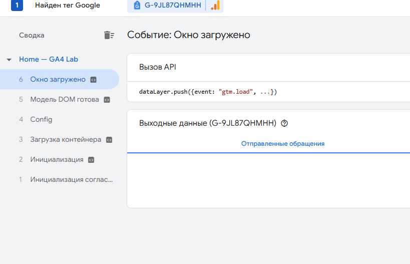
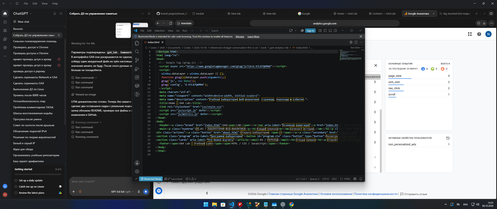
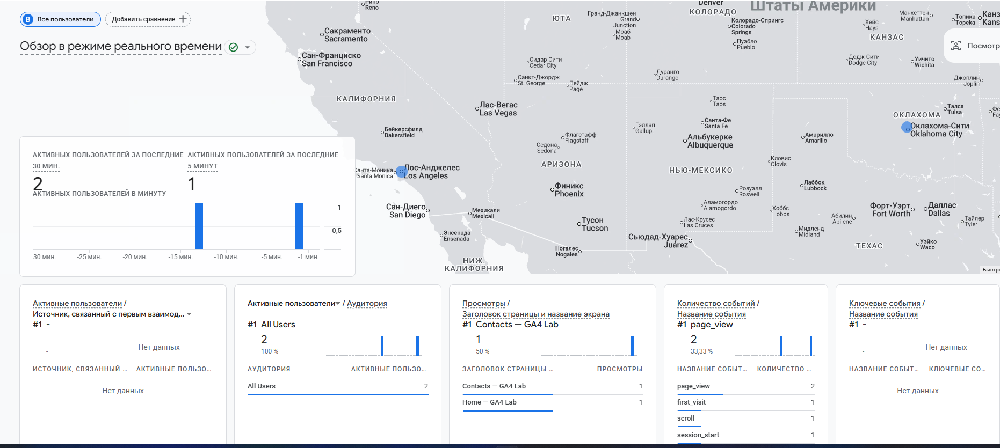
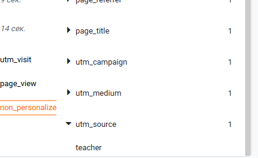
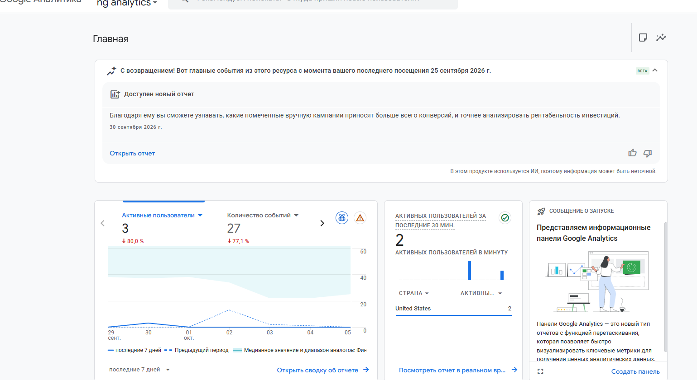

# Домашняя работа № 3 · Тег на сайте, источник и отчёты GA4

**Дисциплина:** ОП.03 «Информационные технологии»

| Поле | Значение |
|---|---|
| Фамилия, имя, отчество | Бугаев Тимофей |
| Группа | РПО 25/2 |
| Номер работы | 3 |
| Тема работы | Установка Google Tag, источник перехода и отчёты GA4 |
| Дата сдачи | 06.10 |
| Ветка | `hw-03` |

## 1. Сайт и ресурс

| Поле | Значение |
|---|---|
| Адрес репозитория сайта | https://github.com/lastuser55556/ga4-analytics-lab |
| Публичный адрес сайта | https://lastuser55556.github.io/ga4-analytics-lab/ |
| Статус публикации | GitHub Pages; сайт открывается по публичному адресу |
| Measurement ID | `G-9JL87QHMHH` |
| Страницы с тегом | `index.html`, `about.html`, `contacts.html` |

Google Tag с указанным Measurement ID присутствует в исходном коде трёх страниц. Контактная форма отправляет данные и UTM-метки в Google Apps Script для записи в учебную Google Таблицу. Поступление событий подтверждено в GA4.

## 2. Тег установлен

Tag Assistant обнаружил Google Tag с Measurement ID `G-9JL87QHMHH` на странице Home.



Исходный код страницы с Google Tag:



## 3. События в аналитике

В Realtime зафиксирован один активный пользователь. Видны страница `Home — GA4 Lab` и автоматически собранные события `first_visit`, `page_view`, `scroll`, `session_start`.



## 4. Источник перехода

Для проверки используется ссылка:

```text
https://lastuser55556.github.io/ga4-analytics-lab/?utm_source=teacher&utm_medium=homework&utm_campaign=ga4_lab
```

В DebugView зафиксировано событие `utm_visit` с источником `teacher`.



## 5. Страница «Отчёты»

В отчётах GA4 отображаются пользователи, события и график за выбранный период.



## 6. Использование ИИ

| Вопрос | Ответ |
|---|---|
| Что сделано самостоятельно | Проверены публичный сайт, репозиторий и наличие тега в коде. |
| Что спрошено у модели | Помощь в оформлении бланка. |
| Что после этого изменено | Неподтверждённые показатели Realtime и отчётов не указаны. |
